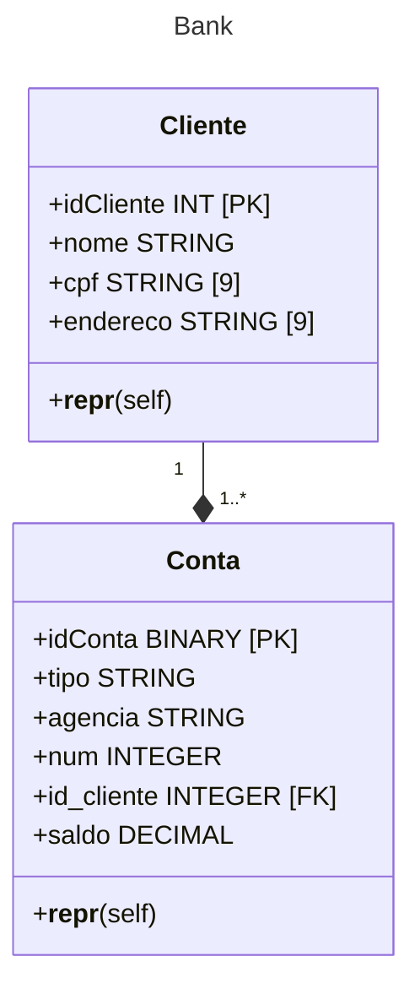

## Parte 1 - Implementando um Banco de Dados Relacional com SQLAlchemy

### Objetivo:

#### Neste desafio você irá implementar uma aplicação de integração com SQLite com base em um esquema relacional disponibilizado. Sendo assim, utilize o esquema dentro do contexto de cliente e conta para criar as classes de sua API. Essas classes irão representar as tabelas do banco de dados relacional dentro da aplicação.

 

 

#### Entregável:

- Aplicação com a definição do esquema por meio das classes usando SQLAlchemy
- Inserção de um conjunto de dados mínimo para manipulação das informações
- Execução de métodos de recuperação de dados via SQLAlchemy

 

## Parte 2 – Implementando um Banco de Dados NoSQL com Pymongo

 

### Você irá implementar um banco NoSQL com mongodb para fornecer uma visão agregada do modelo relacional. Sendo assim, as informações de cliente e contas existentes estão contidas dentro de documentos de acordo com cliente.

 

#### Execute as operações:

- Conecte ao mongo atlas e crie um banco de dados
- Defina uma coleção bank para criar os documetos de clientes
- Insira documentos com a estrutura mencionada
- Escreve instruções de recuperação de informações com base nos pares de chave e valor como feito em aula

